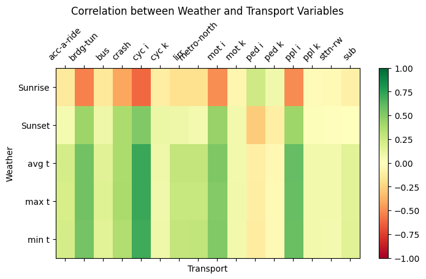

# Rain or Ride

## Project Overview

### Members

|     Name      | NetID  |
| :-----------: | :----: |
| Bongjun Jang  | bj2351 |
|  Luka Tragic  | lt2205 |
| Terrance Chen | tc3325 |

### Structure

1. Ingestion: commands or codes to download data
2. ETL: transform or clean data and store them in HDFS
3. Profiling: provides insights for indivial data
4. Analytics: statistical analysis on all dataset (correlation, etc.)

## Data Access in HDFS

### Location

You can access the data resides in HDFS, by issueing the following command in dataproc.

```
hdfs dfs -ls /user/bj2351_nyu_edu/final/data

Found 3 items
-rw-rwxr--+  1 bj2351_nyu_edu bj2351_nyu_edu     121642 2023-11-30 14:57 final/data/MTA-Daily-Ridership-Data-Beginning-2020.csv
-rw-rwxr--+  1 bj2351_nyu_edu bj2351_nyu_edu    5310911 2023-11-30 14:57 final/data/hourly-weather-nyc-2022.csv
-rw-rwxr--+  1 bj2351_nyu_edu bj2351_nyu_edu   20090169 2023-11-30 14:57 final/data/motor-vehicle-collisions-2022.csv
```

Please ask bj2351@nyu.edu to get your access granted to use `ls` command on `final` directory.
Otherwise, you will not be able to list contents under the directory.

Also, under `hdfs:///user/bj2351_nyu_edu/final` directory, there are several directories:
1. `data` directory for data ingested, which exist in a raw form
2. `cleaned` directory for data cleaned after ETL process.
    - `weather/cond`: weather conditions such as rain, snow, haze, etc. for each day in 2022
    - `weather/agg`: aggregatated weather data for each day, such as temperature (min, max, avg)


For weather data, you can access the file in your spark-shell with the code below.
The filename changes every time we run ETL code, and it's cryptic to read.
Therefore the filename must be identified programmatically as suggested below:

```scala
import org.apache.hadoop.fs.{FileSystem, Path}
import org.apache.hadoop.conf.Configuration

val configuration = new Configuration()
val fileSystem = FileSystem.get(configuration)

val path = "/user/bj2351_nyu_edu/final/cleaned/weather/"

def getFilePath(path: Path): String =  {
  val file = fileSystem
      .listStatus(path)
      .filter(_.getPath.getName.endsWith(".csv"))

  file.head.getPath.toString
}

val aggPath = new Path(path + "agg")
val condPath = new Path(path + "cond")
println(aggPath)
println(condPath)
val aggFile = getFilePath(aggPath)
val condFile = getFilePath(condPath)

val aggDf = spark.read.option("header", true).csv(aggFile)
val condDf = spark.read.option("header", true).csv(condFile)
```

For motor vehicle cleaned collision count data you can use this script that is similar to the above:

```scala
import org.apache.hadoop.fs.{FileSystem, Path}
import org.apache.hadoop.conf.Configuration
import org.apache.spark.sql.{DataFrame, SparkSession}

val directoryPath = new Path("/user/bj2351_nyu_edu/final/cleaned/collisionData")
val csvFilePath = getFilePath(directoryPath)
val df: DataFrame = spark.read.option("header", "true").csv(csvFilePath)

df.show()


```
For motor vehicle collision cleaned data without aggregation 

```scala
import org.apache.hadoop.fs.{FileSystem, Path}
import org.apache.hadoop.conf.Configuration
import org.apache.spark.sql.{DataFrame, SparkSession}

val directoryPath = new Path("/user/bj2351_nyu_edu/final/cleaned/motor-vehicle-collision")
val csvFilePath = getFilePath(directoryPath)

val df: DataFrame = spark.read.option("header", "true").csv(csvFilePath)

df.show()


```

### Permissions

The directories have following permissions:

```
$ hdfs dfs -getfcal /user/bj2351_nyu_edu
# file: /user/bj2351_nyu_edu/final
# owner: bj2351_nyu_edu
# group: bj2351_nyu_edu
user::rwx
user:lt2205_nyu_edu:--x
user:tc3180_nyu_edu:--x
group::---
mask::--x
other::---

$ hdfs dfs -getfacl /user/bj2351_nyu_edu/final
# file: /user/bj2351_nyu_edu/final
# owner: bj2351_nyu_edu
# group: bj2351_nyu_edu
user::rwx
user:lt2205_nyu_edu:rwx
user:tc3180_nyu_edu:rwx
group::r-x
mask::rwx
other::r-x
```


## Analysis

| Fog | tt crash | ppl injured | ppl killed | sub        | bus        | days | ppl injured per day | ppl killed per day | crashes per day | sub per day | bus per day |
|------------|----------|-------------|------------|------------|------------|------|---------------------|--------------------|-----------------|-------------|-------------|
| true       | 8416.0   | 4129.0      | 13.0       | 7.691216E7 | 3.1878012E7| 29   | 142.379             | 0.448              | 290.0           | 2652143.0   | 1099242.0   |
| false      | 95461.0  | 47799.0     | 274.0      | 9.35593719E8| 3.92068812E8| 336  | 142.259             | 0.815              | 284.0           | 2784505.0   | 1166871.0   |

| Mist | tt crash | ppl injured | ppl killed | sub         | bus         | days | ppl injured per day | ppl killed per day | crashes per day | sub per day | bus per day |
|-------------|----------|-------------|------------|-------------|-------------|------|---------------------|--------------------|-----------------|-------------|-------------|
| true        | 35998.0  | 17774.0     | 78.0       | 3.55289869E8| 1.47911003E8| 126  | 141.063             | 0.619              | 286.0           | 2819761.0   | 1173897.0   |
| false       | 67879.0  | 34154.0     | 209.0      | 6.5721601E8 | 2.76035821E8| 239  | 142.904             | 0.874              | 284.0           | 2749858.0   | 1154962.0   |

| Rain | tt crash | ppl injured | ppl killed | sub         | bus         | days | ppl injured per day | ppl killed per day | crashes per day | sub per day | bus per day |
|-------------|----------|-------------|------------|-------------|-------------|------|---------------------|--------------------|-----------------|-------------|-------------|
| true        | 37112.0  | 18576.0     | 87.0       | 3.59742874E8| 1.49923187E8| 130  | 142.892             | 0.669              | 285.0           | 2767253.0   | 1153255.0   |
| false       | 66765.0  | 33352.0     | 200.0      | 6.52763005E8| 2.74023637E8| 235  | 141.923             | 0.851              | 284.0           | 2777715.0   | 1166058.0   |

| Snow | tt crash | ppl injured | ppl killed | sub         | bus         | days | ppl injured per day | ppl killed per day | crashes per day | sub per day | bus per day |
|-------------|----------|-------------|------------|-------------|-------------|------|---------------------|--------------------|-----------------|-------------|-------------|
| true        | 4725.0   | 2024.0      | 9.0        | 3.7627331E7 | 1.5598916E7 | 18   | 112.444             | 0.5                | 263.0           | 2090407.0   | 866606.0    |
| false       | 99152.0  | 49904.0     | 278.0      | 9.74878548E8| 4.08347908E8| 347  | 143.816             | 0.801              | 286.0           | 2809448.0   | 1176795.0   |

| Haze | tt crash | ppl injured | ppl killed | sub         | bus         | days | ppl injured per day | ppl killed per day | crashes per day | sub per day | bus per day |
|-------------|----------|-------------|------------|-------------|-------------|------|---------------------|--------------------|-----------------|-------------|-------------|
| true        | 8360.0   | 4169.0      | 31.0       | 8.5338812E7 | 3.6530611E7 | 30   | 138.967             | 1.033              | 279.0           | 2844627.0   | 1217687.0   |
| false       | 95517.0  | 47759.0     | 256.0      | 9.27167067E8| 3.87416213E8| 335  | 142.564             | 0.764              | 285.0           | 2767663.0   | 1156466.0   |



<details>
    <summary>Corr Data</summary>
    
| Var 1 | Var 2 | Pearson Corr |
| :-: | :-: | :-: |
min t | crash | 0.3542349612104814
min t | ppl i | 0.5845531013122958
min t | ppl k | 0.06555856724944638
min t | ped i | -0.10957094526853005
min t | ped k | -0.0325904308110889
min t | cyc i | 0.7006555559562513
min t | cyc k | 0.08358547262405314
min t | mot i | 0.5078443081139264
min t | mot k | 0.06505212655867684
min t | sub | 0.15665129779988143
min t | bus | 0.15585644526428835
min t | lirr | 0.28781195444582247
min t | metro-north | 0.2966600862340946
min t | acc-a-ride | 0.21554602392510638
min t | brdg-tun | 0.5531898281779136
min t | sttn-rw | 0.06093589600393726
max t | crash | 0.3775524659461287
max t | ppl i | 0.5873874719402673
max t | ppl k | 0.06991272743973675
max t | ped i | -0.10438022617856996
max t | ped k | -0.0365920482021427
max t | cyc i | 0.7164812533752206
max t | cyc k | 0.07468591171200567
max t | mot i | 0.501088612228785
max t | mot k | 0.07156851827297922
max t | sub | 0.149338209946429
max t | bus | 0.1649199672017819
max t | lirr | 0.26739684068142056
max t | metro-north | 0.2683582895085974
max t | acc-a-ride | 0.2031368815097832
max t | brdg-tun | 0.5585861740373308
max t | sttn-rw | 0.06673901553308353
avg t | crash | 0.3740278937117881
avg t | ppl i | 0.5993700459776434
avg t | ppl k | 0.0649174768963727
avg t | ped i | -0.10055736202566946
avg t | ped k | -0.040871322887430166
avg t | cyc i | 0.7139599127099249
avg t | cyc k | 0.07813018163005453
avg t | mot i | 0.5176437137553311
avg t | mot k | 0.06734373076365609
avg t | sub | 0.1554857540309108
avg t | bus | 0.16216227527127997
avg t | lirr | 0.28318119184970664
avg t | metro-north | 0.288738789089319
avg t | acc-a-ride | 0.21290247245431296
avg t | brdg-tun | 0.5610241926660134
avg t | sttn-rw | 0.06597694097160062
Sunrise | crash | -0.4193857672323521
Sunrise | ppl i | -0.5005892246916367
Sunrise | ppl k | -0.030772896092594874
Sunrise | ped i | 0.23949334271230252
Sunrise | ped k | 0.07148125936548586
Sunrise | cyc i | -0.612846456085375
Sunrise | cyc k | -0.10198832597113647
Sunrise | mot i | -0.49662676331137834
Sunrise | mot k | -0.057525478340458666
Sunrise | sub | -0.09370342965369291
Sunrise | bus | -0.14190918218131582
Sunrise | lirr | -0.18587951558216328
Sunrise | metro-north | -0.18310994171489725
Sunrise | acc-a-ride | -0.1325261980444854
Sunrise | brdg-tun | -0.5336543366433003
Sunrise | sttn-rw | -0.03653948160503098
Sunset | crash | 0.36832812726077524
Sunset | ppl i | 0.4174632430849236
Sunset | ppl k | 0.018444473955051242
Sunset | ped i | -0.27946130915414974
Sunset | ped k | -0.09606087264597117
Sunset | cyc i | 0.5142780005356611
Sunset | cyc k | 0.09478384204458541
Sunset | mot i | 0.44443231785421555
Sunset | mot k | 0.06647289134065691
Sunset | sub | 0.0025402718390077654
Sunset | bus | 0.09080597476872293
Sunset | lirr | 0.08988839865275147
Sunset | metro-north | 0.054975858069086905
Sunset | acc-a-ride | 0.04907194339823081
Sunset | brdg-tun | 0.42628235099576584
Sunset | sttn-rw | -0.01026206856407811
</details>

Multiple Linear Regression for Collision Data and Weather/Ridership
Independent Variable = m(Dependent Variable) + m(Dependent Variable) + m(Dependent Variable) + m(Dependent Variable) + y


### Crash Model

$$
\text{Crash} = \text{"min t"} + \text{"max t"} + \text{"sub"} + \text{"bus"}
$$

| Coefficient                  | Value                         |
|------------------------------|-------------------------------|
| Coefficients                 | -0.4954345439262705, 1.070617034335645, 2.4074178661484523E-5, -1.2671052425481895E-5 |
| Intercept                    | 191.37396866922882            |
| R-squared                    | 0.32806364323159776           |
| T-values                     | -1.312836895222827, 3.0157621088365447, 2.4257693352086154, -0.5721152220702017, 21.08138445027665 |

### People Injured Model

$$
\text{ppl injured} = \text{"min t"} + \text{"max t"} + \text{"sub"} + \text{"bus"}
$$

| Coefficient                  | Value                         |
|------------------------------|-------------------------------|
| Coefficients                 | 0.19576336297463307, 0.7278969976793589, 2.9592430959578923E-5, -4.5496535301402454E-5 |
| Intercept                    | 58.25975435701208             |
| R-squared for 'ppl injured'  | 0.5166896621880659            |
| T-values for 'ppl injured'   | 0.748115406148318, 2.95696069318998, 4.300226763183985, -2.962523694528308, 9.255451437415037 |

### People Killed Model

$$
\text{ppl killed} = \text{"min t"} + \text{"max t"} + \text{"sub"} + \text{"bus"}
$$

| Coefficient                  | Value                         |
|------------------------------|-------------------------------|
| Coefficients                 | -0.0020871325384426475, 0.007215248346745538, 5.270624772673839E-7, -1.16071061004801E-6 |
| Intercept                    | 0.34057163497324794           |
| R-squared for 'ppl k'        | 0.018731209264052917          |
| T-values for 'ppl k'         | -0.15658700694835556, 0.5754338691880505, 1.5036311925158352, -1.4838020769741196, 1.0621991373528936 |

This formatting provides a clear and structured presentation of your models and their respective coefficients, intercepts, R-squared values, and T-values.


<details>
    <summary>Multiple Linear Regression Raw Data</summary>

Crash = "min t" +"max t"+ "sub" + "bus"\
Coefficients: [-0.4954345439262705,1.070617034335645,2.4074178661484523E-5,-1.2671052425481895E-5] Intercept: 191.37396866922882\
R-squared: 0.32806364323159776\
T-values: -1.312836895222827, 3.0157621088365447, 2.4257693352086154, -0.5721152220702017, 21.08138445027665

ppl injured = "min t" +"max t"+ "sub" + "bus"\
Coefficients: [0.19576336297463307,0.7278969976793589,2.9592430959578923E-5,-4.5496535301402454E-5] Intercept: 58.25975435701208\
R-squared for 'ppl injured': 0.5166896621880659\
T-values for 'ppl injured': 0.748115406148318, 2.95696069318998, 4.300226763183985, -2.962523694528308, 9.255451437415037

ppl killed = "min t" +"max t"+ "sub" + "bus"\
Coefficients: [-0.0020871325384426475,0.007215248346745538,5.270624772673839E-7,-1.16071061004801E-6] Intercept: 0.34057163497324794\
R-squared for 'ppl k': 0.018731209264052917\
T-values for 'ppl k': -0.15658700694835556, 0.5754338691880505, 1.5036311925158352, -1.4838020769741196, 1.0621991373528936
</details>


